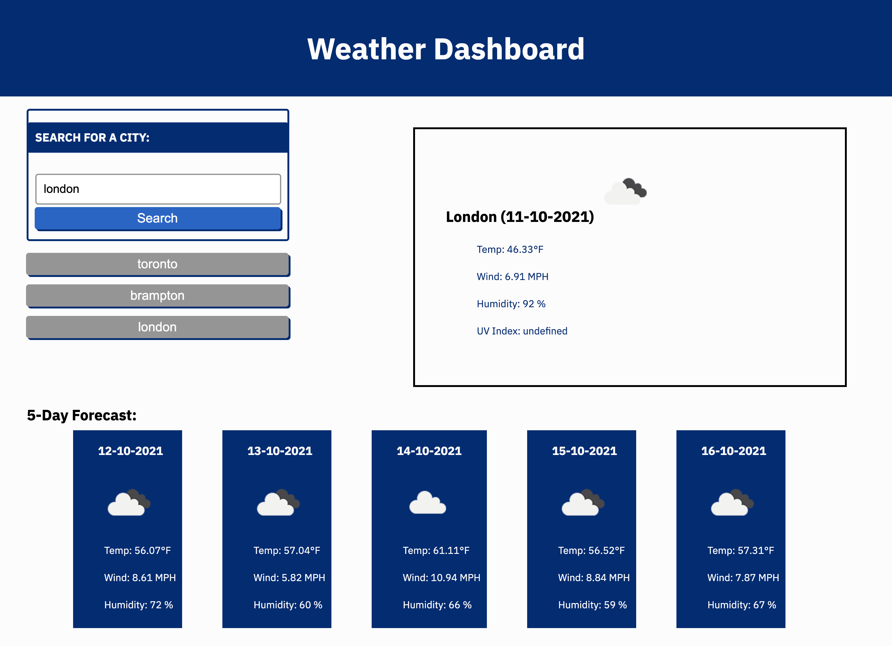

# 06 Weather Dashboard

## Project Description

This is a weather dashboard application that allows a user to view the current weather conditions of a city and a 5-day weather forecast. When the user inputs a city, it gets stored into local storage. The application runs in the browser and runs on a third-party API and dynamically updating HTML and CSS powered by JavaaScript.

## Screenshot

The following image shows the weather dashboard application's appearance and functionality:

You can view the webpage at: <https://github.com/ArshleenKNagpal/weather-dashboard>
The URL of the GitHub repository is: <https://arshleenknagpal.github.io/weather-dashboard/>

- - -
© 2021 Trilogy Education Services, LLC, a 2U, Inc. brand. Confidential and Proprietary. All Rights Reserved.
